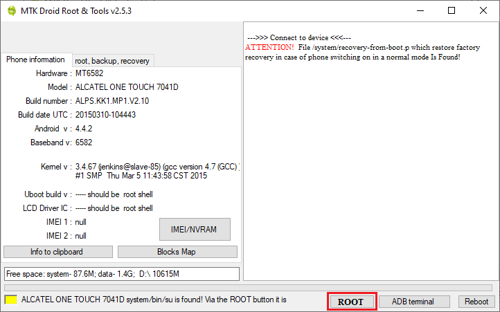
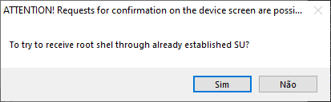
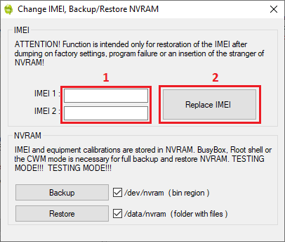
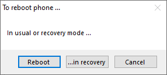

# Recuperando o IMEI

### Atenção:
```diff
- A execução deste procedimento pode resultar em danos permanentes. 
- Não responsabilizo-me por qualquer dano causado, prossiga por sua conta e risco.
- A alteração do IMEI do aparelho é crime! Utilize apenas os valores originais do aparelho.
```
### Requisitos:

- Atualização 4.4.2 instalada com <a href="/UPDATE_OFW.md">partição padrão</a> ou com <a href="/UPDATE_MOD_OFW.md">partição modificada</a>
- <a href="/INSTALL_ROOT.md">Aparelho com ROOT</a>
- MTK Droid Tools 2.5.3

### Instalação:

1. Habilite o modo desenvolvedor e a depuração USB
2. Abra o arquivo ```MTKdroidTools.exe```
3. Após o programa iniciar, conecte o cabo USB e permita a depuração USB no aparelho
4. Clique em ```ROOT```

<p align="center" width="600"></p>

5. Clique em ```SIM``` no diálogo que aparecer

<p align="center" width="600"></p>

6. Permita que a aplicação tenha acesso ROOT no aparelho e aguarde
7. Após o carregamento o status da conexão deverá está conforme a imagem

<p align="center" width="600"></p>

8. Clique em ```IMEI/NVRAM```

9. Na janela que abrir adicione os valores de IMEI nos campos e clique e em ```Replace IMEI```

<p align="center" width="600"></p>

10. Clique em ```SIM``` no diálogo que aparecer

11. Clique no botão de ```Reboot```

<p align="center" width="600"></p>

12. Clique em ```Reboot``` no diálogo que aparecer e aguade a reinicialização do sistema

<p align="center" width="600"></p>

13. Pronto, os valores do IMEI foram reparados

